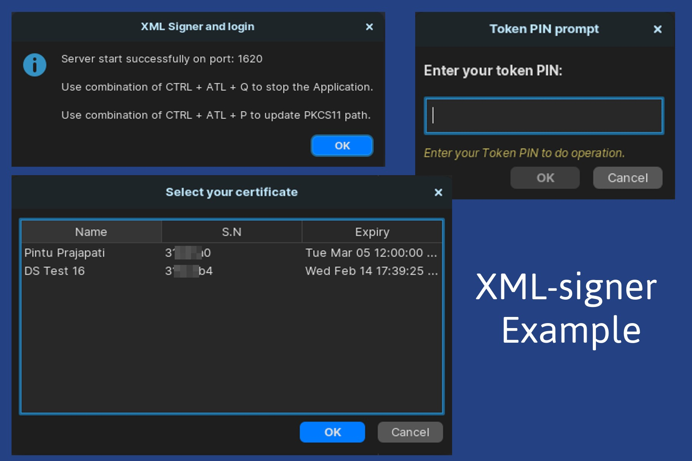

<br/>
<p align="center">
  <h3 align="center">XML - Signer</h3>

  <p align="center">
    A Java-based XML signer utilizing a PKCS11 USB token and an X509 certificate.
    <br/>
    <br/>
  </p>
</p>

## About The Project



## XML Signer API with PKCS11 USB Token Support

The XML Signer API with PKCS11 USB Token is a Java-based utility that offers a comprehensive set of features for XML signing, token management, certificate selection, and certificate validation. This API is designed to streamline the process of digitally signing XML documents using a PKCS11 USB token, ensuring security and compliance in your applications.

### Features

1. **XML Signing:** Easily sign XML documents using the PKCS11 USB token. The API provides a seamless way to apply digital signatures to your XML content, adding a layer of authenticity and tamper-proofing.

2. **Token PIN Prompt:** The API allows you to securely prompt for the PIN associated with the PKCS11 USB token. This ensures that the token's private key remains protected while enabling seamless signing.

3. **USB Token Login Session:** Establish and manage a secure login session with the PKCS11 USB token. This session management ensures that the token remains accessible only to authorized users during the signing process.

4. **Multiple Certificate Selection:** When multiple certificates are available on the PKCS11 USB token, the API enables users to select the appropriate certificate for signing, ensuring accurate identification.

5. **Certificate Validation:** Verify the validity of certificates used for signing. The API includes built-in mechanisms to check certificate revocation status and expiration, enhancing the reliability of the signed XML documents.

6. **Localhost API Integration:** The API comes with a built-in localhost API, facilitating seamless integration with your applications. This integration allows developers to easily incorporate XML signing capabilities into their projects.

## Getting Started

To start using the XML Signer API with PKCS11 USB Token, follow these steps:

This application use **1620** port number as default

### Prerequisites

1. **java version 8**

## Usage

##### Request header
1. Content-Type = application/xml

#### XML Request format
```xml
<request>
	<command>pkiNetworkSign</command>
	<ts>{iso-8601 format timestamp}</ts>
	<txn>{Unique transaction id}</txn>
	<certificate>
		<attribute name='CN'></attribute>
		<attribute name='O'></attribute>
		<attribute name='OU'></attribute>
		<attribute name='T'></attribute>
		<attribute name='E'></attribute>
		<attribute name='SN'></attribute>
		<attribute name='CA'></attribute>
		<attribute name='TC'>sg</attribute>
		<attribute name='AP'>1</attribute>
	</certificate>
	<file>
            <attribute name='type'>xml</attribute>
	</file>
	<data>{Base64 encoded XML data or file}</data>
</request>
```
#### Success Response

```xml
<response>
	<command>Pkinetworksign</command>
	<ts>{iso-8601 format timestamp}</ts>
	<txn>{Unique transaction id, same of the requested id}</txn>
	<status>ok</status>
	<file>
            <attribute name="type">xml</attribute>
	</file>
    <data>{Signed XML data in base64}</data>
</response>
```

#### Error Response

```xml
<response>
    <command>pkiNetworkSign</command>
    <ts>Fri Nov 03 12:49:20 IST 2023</ts>
    <txn>2023-11-03T12:03:42.7853433 05:30</txn>
    <status>failed</status>
    <error code='OT-02'>User canceled the request</error>
</response>
```

## License

Distributed under the MIT License. See [LICENSE](https://github.com/pyojan/XML_signer/blob/main/LICENSE.md) for more information.

## Authors

* **Pintu Prajapati** - [Pintu Prajapati](https://github.com/pyojan/)
